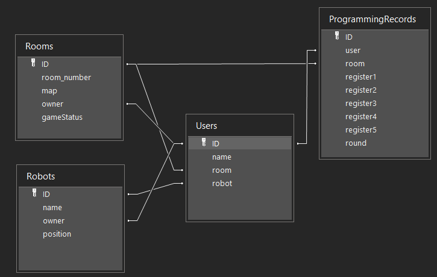

# API server for RoboRally Java Game Agile course

| User Endpoints                                   | Description |  Response |
| -------------------------------------------| ---------| --- |
| ``POST /createUser/[username]``            | Creates a user | ``status 400`` - user already exists   ``status 200`` - user created successfully |
|``PUT /chooseRobot/[username]/[robot_name]``| Assigns user a robot | ``status 404`` - user not found   ``status 200`` - robot chosen successfully |
|``PUT /joinRoom/[username]/[room_number]``  | User joins a room | ``status 404`` - user not found   ``status 200`` - user joins a room successfully   ``status 400`` - room does not exist |
| ``PUT /exitRoom/[username]``| User exits a room | ``status 404`` - user not found   ``status 401`` - user is not currently in any room   ``status 200`` - user exits room => response body contains code of the room user has exited |
| ``DELETE /deleteUser/[username]`` | Deletes a user | ``status 404`` - user not found   ``status 200`` - user deleted successfully |
| **Room Endpoints** | **Description** | **Response** |
|``POST /createRoom/[username]/[map_name]``  | Creates a room | ``status 200`` - room created successfuly => response body contains code of the new room   ``status 404`` - user not found  ``status 400`` -  User already in a room |
|``GET /roomInfo/[room_number]``          | List of players in a room | ``status 404`` - room not found   ``status 401`` - room owner not found   ``status 200`` - response body contains the list of players in the room, the time the request was made and the status of the game in the room |
|``DELETE /deleteRoom/[room_number]``              | Deletes a room |  ``status 404`` - room not found   ``status 200`` - deletes the room|
| ``PUT /updateStatus/[room_number]/[status]`` | Updates the status of a game room | ``status 200`` - status has been updated   ``status 404`` - room not found |
| **Robot Endpoints** | **Description** | **Response** |
| ``PUT /updateRobotPosition/[username]/[pos_x]/[pos_y]`` | Updates robot position | ``status 200`` - robot position has been updated   ``status 404`` - user not found   ``status 401`` - user does not have any robot |
| ``PUT /updateRobotDirection/[user]/[direction]`` | Updates robot direction | ``status 200`` - robot direction has been updated   ``status 404`` - user not found   ``status 401`` - user does not have any robot |
| ``GET /getRobotInfo/[username]`` | Get coordinates of users's robot and robot's name | ``status 200`` - response body contains name of the robot, coordinates x, y and direction of the robot  ``status 401`` - user does not have any robot   ``status 404`` - user not found |
| ``DELETE /deleteRobot/[username]`` | Deletes a robot from the DB | ``status 200`` - robot deleted successfully   ``status 400`` - robot not found   ``status 404`` - user not found |
| **ProgrammingRecord Enpoints** | **Description** | **Response** |
| ``GET /getProgrammingRecords/:roomNumber/:round`` | All players playing in a room in a certain round | ``status 200`` - list of player names returned and the request time   ``status 404`` - room not found |
| ``POST /createProgrammingRecord`` request body contains: username, roomNumber, round, register1, register2, register3, register4, register5 | Creates a new programming record in a specific room in a specific round | ``status 200`` - record created   ``status 400`` - user not found   ``status 401`` - room not found   ``status 402`` - user not joined the room |

# DataBase Design

